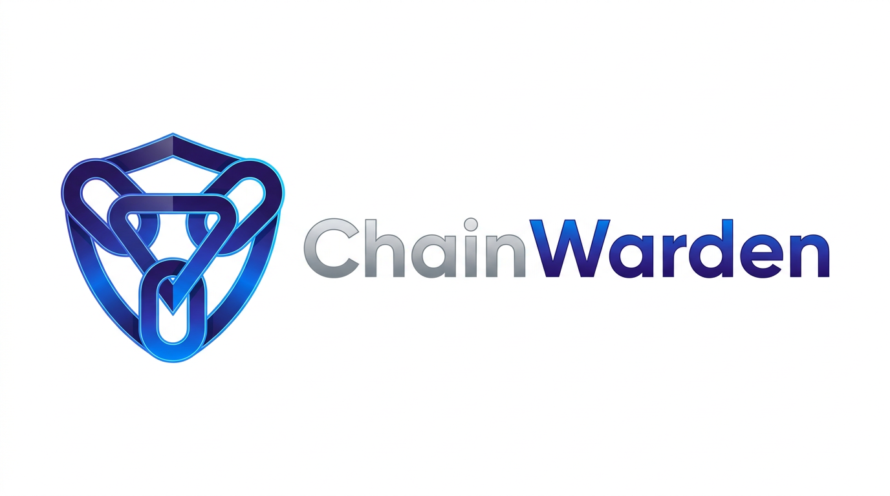
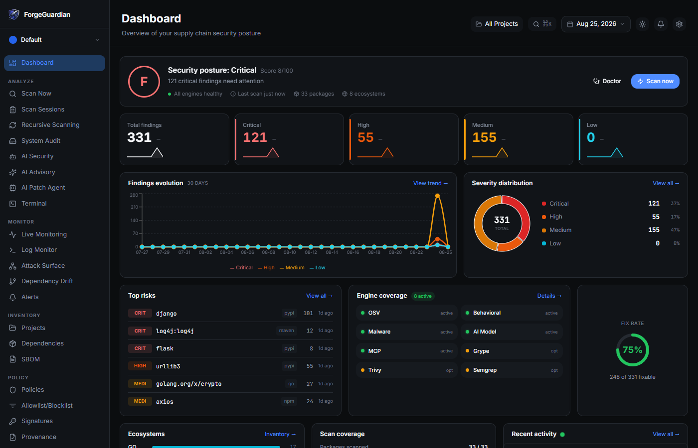
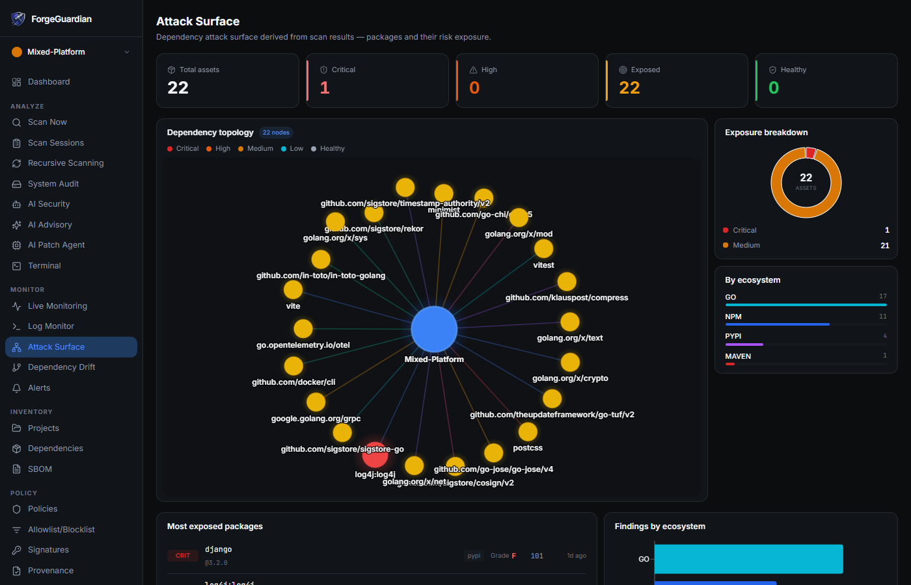
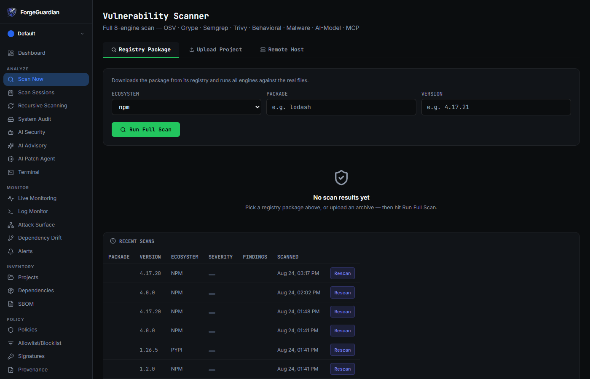

<p align="center">
  
</p>

<h3 align="center">ChainWarden</h3>

<p align="center">
  <strong>Supply chain security scanner for every package you depend on.</strong><br/>
  8 scan engines. 9 ecosystems. 223+ detection signatures. Behavioural trust scoring. Works offline.
</p>

<p align="center">
  
  
  
  
  
</p>

<p align="center">
  
</p>

---

## Install

One command. No account needed.

```bash
curl -sSfL https://raw.githubusercontent.com/deepak-ff/supply_chain/main/install.sh | bash
```

<details>
<summary>Windows (PowerShell)</summary>

```powershell
irm https://raw.githubusercontent.com/deepak-ff/supply_chain/main/install.ps1 | iex
```
</details>

<details>
<summary>Docker</summary>

```bash
docker run -d --name chainwarden -p 3000:3000 ghcr.io/deepak-ff/chainwarden
```
Open **http://localhost:3000**
</details>

<details>
<summary>Build from source</summary>

```bash
git clone https://github.com/deepak-ff/supply_chain.git
cd ChainWarden && make build
```
</details>

---

## Scan

```bash
cwctl scan .
```

That's it. Scans your project, shows findings with severity and fix versions.

---

## Dashboard

Start the web dashboard:

```bash
cwctl serve
```

Open **http://localhost:8080** — SOC-style overview with security posture grading, severity trends, real-time alerts, and risk heatmaps.

**Run it yourself:** `cwctl serve` → http://localhost:3000

### 30+ pages across 7 categories

**Analyze** — Multi-engine vulnerability scanner (registry + file upload + remote SSH), scan session history with JSON/CSV/HTML export, recursive directory scanning, system audit across all package managers

**AI-Powered** — AI security analysis, AI advisory with remediation guidance, autonomous patch agent

**Monitor** — Live monitoring with auto-quarantine, structured log viewer, dependency topology with attack surface mapping, dependency drift detection, alert timeline

<p align="center">
  
</p>

**Inventory** — Multi-workspace project management, dependency inventory with risk grades, SBOM generation (CycloneDX + SPDX)

**Policy** — Policy-as-code rules, allowlist/blocklist management, Sigstore keyless signing + verification, provenance tracking, signature authoring with guided wizard

**Integrations** — Webhook alerts (Slack, Discord, HTTP), CI/CD pipeline config, report exports

**Tools** — Built-in web terminal for CLI commands, developer docs, API reference, settings

<p align="center">
  
</p>

---

## 8 Scan Engines

Every scan runs all available engines concurrently:

| Engine | Status | What it catches |
|---|---|---|
| **OSV** | always runs | Known CVEs via osv.dev |
| **Behavioral** | always runs | Malicious install scripts, typosquatting |
| **Malware** | always runs | Byte/regex pattern matching |
| **AI Model** | always runs | Unsafe HuggingFace weights |
| **MCP** | always runs | Prompt injection in tool descriptions |
| **Grype** | optional | Deep CVE scan of artifacts |
| **Trivy** | optional | Container + OS scanning |
| **Semgrep** | optional | SAST static analysis |

Missing an optional engine? Run `cwctl doctor --fix` to auto-install them.

---

## 9 Ecosystems

npm, PyPI, Go, Maven, RubyGems, Cargo/crates.io, NuGet, HuggingFace, GitHub Actions

---

## 223+ Community Signatures

ChainWarden ships with 223+ detection signatures covering real supply chain attacks (2016-2026):

| Type | What it catches | Count |
|---|---|---|
| `blocklisted_package` | Confirmed malicious packages (event-stream, XZ utils, Shai-Hulud worm...) | 80 |
| `behavioral_rule` | Install-time env harvest, SSH key theft, dep confusion | 42 |
| `malware_pattern` | Obfuscated loaders, crypto miners, RATs, credential stealers | 44 |
| `typosquatting_target` | Popular packages + known typosquat variants | 27 |
| `mcp_injection_pattern` | Tool shadowing, data exfil via MCP | 13 |
| `pickle_rule` | Unsafe AI model weights, missing model cards | 12 |

**Update signatures:**
```bash
cwctl update
```

**Create your own:**
```bash
cwctl intel new          # guided wizard
cwctl intel validate .   # validate schema
cwctl intel test .       # test against real package
```

---

## CI/CD

Drop into any GitHub Actions workflow:

```yaml
- name: Install ChainWarden
  run: |
    curl -sSfL https://raw.githubusercontent.com/deepak-ff/supply_chain/main/install.sh | bash
    echo "$HOME/.local/bin" >> $GITHUB_PATH

- name: Scan
  run: cwctl scan . --ci --fail-on=high --format=sarif > results.sarif

- name: Upload to GitHub Security
  uses: github/codeql-action/upload-sarif@v3
  with:
    sarif_file: results.sarif
```

---

## Dynamic Trust Score

Signature scanning answers *"has anyone seen this package do something bad?"*. ChainWarden also
answers a second question that catches the attacks nobody has a signature for yet:

> **Is this release still behaving like itself?**

The trust engine keeps a per-package behavioural ledger — install hooks, outbound network
primitives, writes outside the package root, process spawns, obfuscation density, maintainer churn,
artifact size, dependency count, finding mix — and learns a statistical baseline (mean + standard
deviation per metric) from the package's own history. Every new release is scored against that
baseline in the risk-increasing direction only, producing a 0–100 trust score and a
`LEARNING → GREEN → AMBER → RED` state.

A package with three years of boring releases that suddenly gains a `postinstall` hook and nine
outbound calls collapses to RED **before** anyone writes a signature for it.

```bash
# Learn from your scans
cwctl scan . --format json > scan.json
cwctl trust from-scan scan.json --package npm:express

# See the ledger
cwctl trust list
cwctl trust show npm:express

# Gate CI on behavioural drift, not just CVEs
cwctl trust from-scan scan.json --package npm:express --fail-on red

# No data yet? Replay a compromise pattern against a synthetic history
cwctl trust simulate --scenario hijack
```

```
  npm:express@4.19.0
  ────────────────────────────────────────────────────────────
  Trust score   22/100   [RED]
  Baseline      7 observation(s)
  Verdict       8 behavioural deviation(s): outbound network calls, obfuscation density, ...

  Behavioural drift
    [CRITICAL] Outbound network calls       −18 pts  (z=8.0)
               rose from a previously constant 1 to 9 — no precedent in the package history
    [HIGH    ] Install lifecycle hooks      −12 pts  (z=5.0)
               rose from a previously constant 0 to 2 — no precedent in the package history
```

Scenarios: `hijack` (stolen publish token), `sleeper` (payload assembled across releases),
`takeover` (maintainer change then out-of-cadence publish), `clean` (control case).

Also available in the dashboard under **Monitor → Trust Score**, and over the API at
`GET /api/v1/trust`, `GET /api/v1/trust/:ecosystem/:name`, `POST /api/v1/trust/observe`,
`POST /api/v1/trust/simulate`.

Design notes: [docs/TRUST_SCORE.md](docs/TRUST_SCORE.md).

---

## Key Features

- **Offline-first** — all scans run locally, no data leaves your machine
- **AI triage** — optional AI advisory and patch agent (supports multiple providers)
- **Multi-workspace** — organize projects into workspaces with independent scan histories
- **SBOM** — CycloneDX 1.5 + SPDX 2.3 generation
- **Sigstore signing** — keyless artifact signing + verification
- **Policy-as-code** — YAML policy rules, deny lists, threshold enforcement
- **Attack surface mapping** — dependency topology graph with risk visualization
- **Webhooks** — Slack, Discord, generic HTTP alerts
- **Risk scoring** — A-F letter grades per package
- **Dynamic Trust Score** — longitudinal behavioural baselines with drift detection per package
- **Scan sessions** — full history with JSON/CSV/HTML export
- **Web terminal** — run CLI commands from the dashboard
- **Self-hostable** — Docker one-liner, airgap-compatible
- **SLSA Level 3** — provenance for every release

---

## Free vs Pro

The engine, CLI, and community tools are **Apache 2.0, free forever**. Pro adds team features.

| | Community (Free) | Pro |
|---|---|---|
| CLI scan + all 8 engines | Yes | Yes |
| SBOM, signing, provenance | Yes | Yes |
| Community signatures | Yes | Yes |
| Dashboard (self-hosted) | Yes | Yes |
| Alerts, policies, webhooks | Yes | Yes |
| AI advisory + patch agent | Yes | Yes |
| Team management + RBAC | — | Yes |
| Cloud-hosted option | — | Yes |
| SLA + priority support | — | Yes |

---

## Privacy

- Zero telemetry — phones home for nothing
- AI features are opt-in — supports multiple providers including local LLMs
- Self-hostable and airgap-compatible
- SBOMs and provenance published for every release

---

## Contributing

Fastest path: **write a detection signature** — no Go knowledge needed:

```bash
cwctl intel new    # guided wizard, ~10 minutes
```

For code contributions: fork, branch, PR. See [CONTRIBUTING.md](CONTRIBUTING.md).

Security issues: [SECURITY.md](SECURITY.md).

---

## Project lineage

ChainWarden began as **SCBTSS**, a Flask prototype that monitored vendor software for behavioural
deviation and scored it with a Dynamic Trust Score. That prototype is preserved, unmodified, under
[`legacy/scbtss-prototype/`](legacy/scbtss-prototype/) — its trust-scoring idea now lives in Go as
[`internal/trust`](internal/trust/) and is wired through the CLI, API and dashboard.

The scanning platform around it builds on the Apache-2.0 licensed
[ForgeGuardian](https://github.com/Mah3Sec/ForgeGuardian) project; ChainWarden is an independent
fork with its own module path, CLI (`cwctl`), signature namespace (`CW-*`), release pipeline and
trust engine. Attribution is retained in [NOTICE](NOTICE).

---

## License

Apache License 2.0 — [LICENSE](LICENSE)
